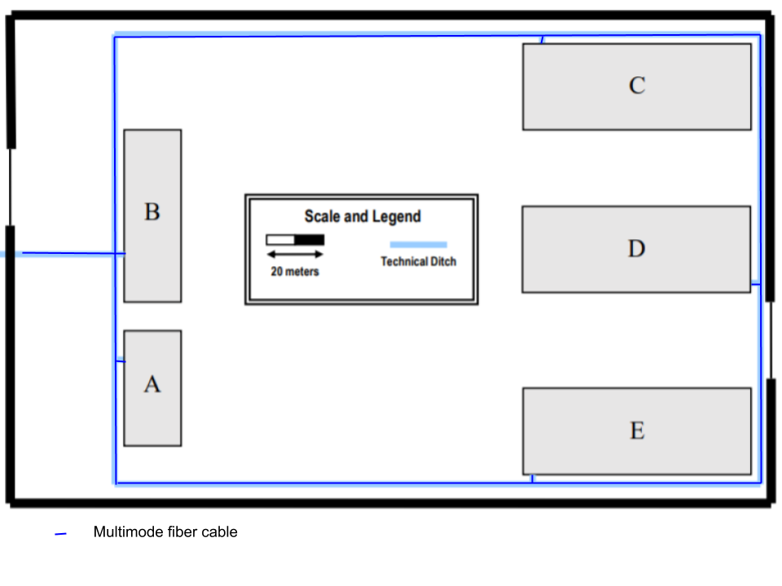

Emcopassing the Campus Backbone
===========================================
(This folder is to be created/edited by the team member 1180573 only)

## Building Dimensions:

- A : 40 x 20 meters
- B : 60 x 20 meters
- C,D and E : 80 x 30 meters

## Cable Types

     In this project to suport the backbone we have two multimode fiber cables. 
     We picked the multimode fiber because the length is greater than 90  meters (maximum length for copper cables) and lass than 1000 meters (maximum length for multimode fiber cable) and has a fine transmission data rate.

## Cable Pathways

     As main objective we conected all the buildings through the MC in the building A using the cable type described above. We used two cables of fiber for each transmission direction (full duplex) and other two for fail-tolerance (failover).

## Backbone

     To support the failover we opted to implement 8 cables of fiber for each building (making a total of 8 * 4 = 32 cables). For each building we have 4 cables going in the oposite direction of the other 4 cables. This is for failover prevention.

## Backbone Inventory

- Fiber: 24 000 meters

## Global Inventory

- **Outlets**: 1138
- **Fiber**: 25 500 meters
- **CAT7**: 45 000 meters
- **Consolidation Points**: 38
- **Access-Points**: 20
- **CAT7 48 port copper Patch Panels**: 20
- **CAT7 24 port copper Patch Panels**: 20
- **24 port Fibre Patch Panels - 24**: 6
- **Telecommunications Enclosures (6U, 1m depth)**: 2
- **Telecommunications Enclosures (12U, 1m depth)**: 5
- **Patch Cords (Copper)**: 2300
- **Patch Cords (Fiber)**: 160

    

     
  

            

