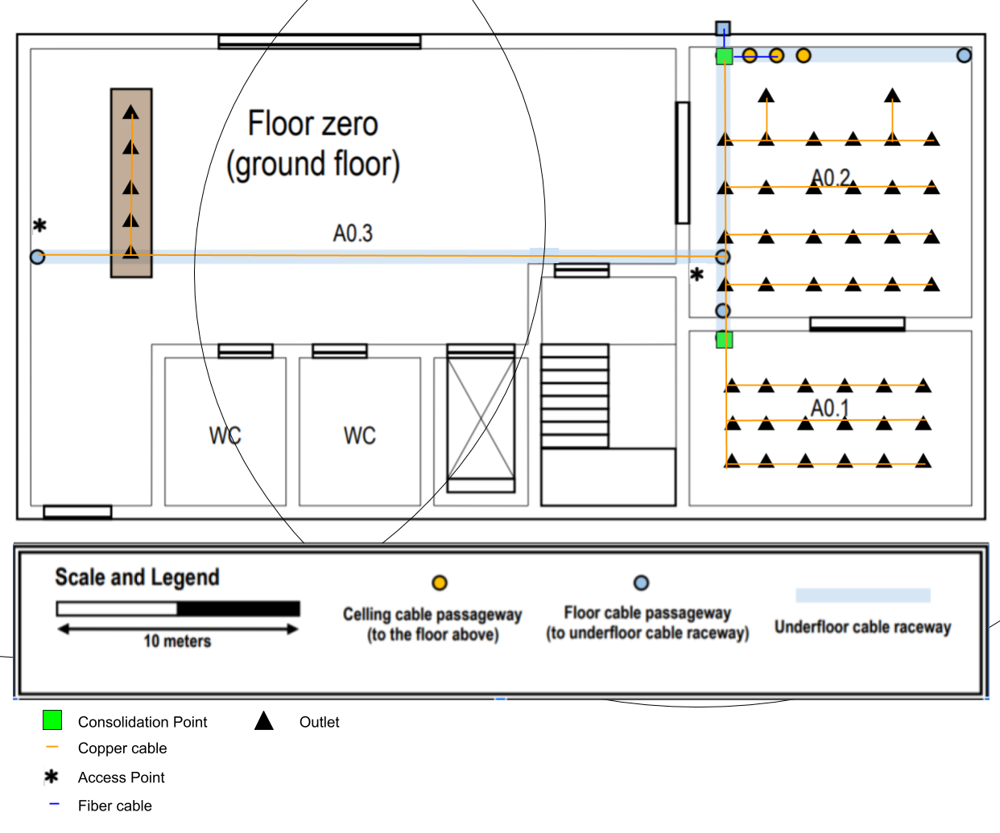

Network cabling deployment schematics of Building A
======================================================

## Room dimensions:

- A0.1 : ~ 11.5 x 7.3 m (84 m^2) = min. 18 outlets (Standard)
- A0.2 : ~ 11.5 x 11.2 m (128 m^2) = min. 26 outlets (Standard) + 1 (Access Point)
- A0.3 : 5 outlets + 1 (Access Point)
  
### Total of outlets : 48 (+2 Access Points)

## Access-Points Locations:
         
         In this floor there are two access-points. One is close to the table to cover the room A0.3 and the other is located in the A0.2 to cover the room A0.2 and A0.1.

## Cable Types

         Between the HC and the outlets the type of cables used where cobre cables, because the max length didn't go beyond the 90 meters and the end user is most likely to have compatible devices with ethernet cables.

## Cross-conect Locations:

         Regarding cross-conects locations, in this floor there's only consolidation points. This is due to the fact that in booth floors there's not a high number of outlets therefrom there's only one HC that is located in the floor above. The consolidation points are there due to the density of the outlets.

## Iventory
- Outlets: 50
- CAT7: 1000 meters
- Fiber: 80 meters
- Consolidation Points: 2
- Access-Points: 2
- Patch Cords (Copper): 250 meters 

        

            

