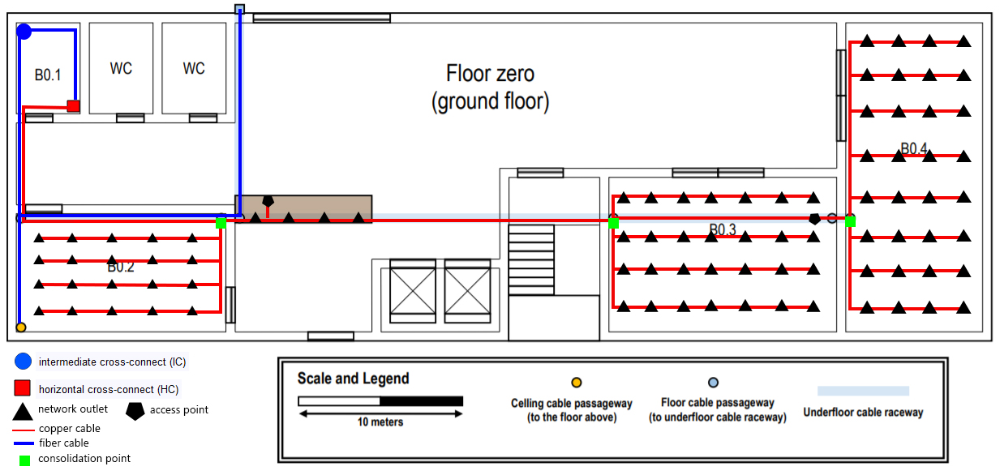
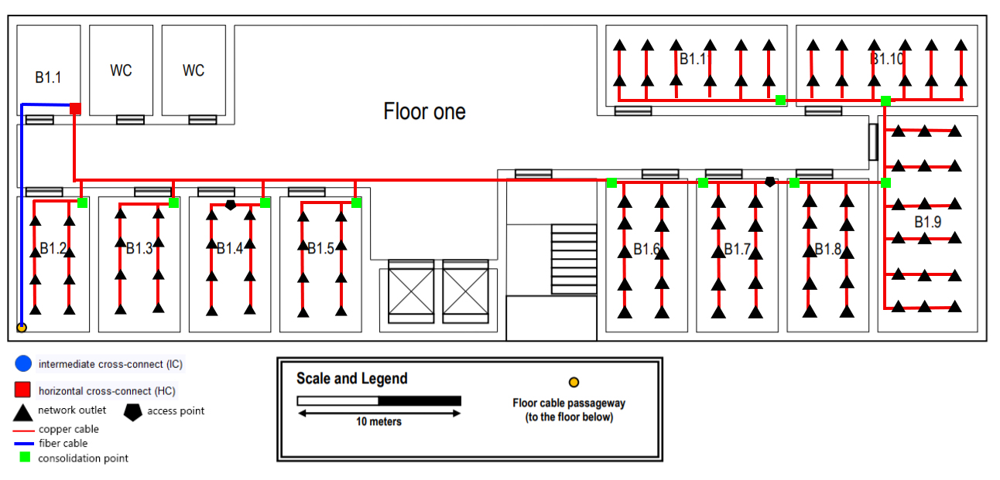

# Building B #

## Number of outlets calculation ##

Regarding the number of room outlets, the following rule was applied. It is required 2 minimum outlets per room and for each 10^2m^2 of area of a room 
another extra 2 outlets.

## Ground floor ##

### Room B0.2 ###

Dimensions: 12,67m x 7,12m  
Area: 90,2m^2  
Calculation regarding number of room B0.2 outlets:  
90,2/10=9  
9*2=18  
18+2=20 outlets  

### Room B0.3 ###

Dimensions: 13,89m x 9,38m  
Area: 130,2m^2  
Calculation regarding number of room B0.3 outlets:  
130,3/10=13  
13*2=26  
26+2=28 outlets  

### Room B0.4 ###

Dimensions: 8,33m x 18,75m  
Area: 156,2m^2  
Calculation regarding number of room B0.4 outlets:  
156,2/10=15  
15*2=30  
30+2=32  

### Service Desk ###

Dimensions: 8,33m x 1,33m  
Area: 14,4m^2  
Calculation regarding number of Service Desk outlets:  
14,4/10=1  
1*2=2  
2+2=4 outlets  

## First Floor ##

### Room B1.2 ###

Dimensions: 4,51m x 8,33m  
Area: 37,6m^2  
Calculation regarding number of room B1.2 outlets:  
37,6/10=3  
3*2=6  
6+2=8 outlets  

### Rooms B1.3/B1.4/B1.5 ###

Dimensions: 4,86m x 8,33m  
Area: 40,5m^2  
Calculation regarding number of rooms B1.3/B1.4/B1.5 outlets:  
40,5/10=4  
4*2=8  
8+2=10 outlets  

### Rooms B1.6/B1.7/B1.8 ###

Dimensions: 4,86m x 9,72m  
Area: 47,2m^2  
Calculation regarding number of rooms B1.6/B1.7/B1.8 outlets: 
47,2/10=4  
4*2=8  
8+2=10 outlets  

### Room B1.9 ###

Dimensions: 6,32m x 13,19m  
Area: 83,4m^2  
Calculation regarding number of room B1.9 outlets:  
83,4/10=8  
8*2=16  
16+2=18 outlets  

### Rooms B1.10/B1.11 ###

Dimensions: 11,11m x 4,86m  
Area: 53,9m^2  
Calculation regarding number of room B1.10/B1.11 outlets:  
53,9/10=5  
5*2=10  
10+2=12 outlets  

## Building Plans ##

First of all, each floor needs to have a horizontal cross-connect that is going to be placed in a storage room. In this case it was placed inside the rooms B0.1 and B1.1, since it was
informed in the project description that those rooms were meant for that. Also the horizontal cross-connects placed make sure that every outlet placed is in less than 80 meters. 
The intermediate cross-connect was also placed in room B0.1 since it should be placed inside a dedicated or a storage room and also in this floor is located the place where the cables can 
come in from the main cross-connect.   
The number of outlets was counted ( as previous shown in this document) and placed in a way that allows the existence of an outlet in less that 3 meters no matter where a person is 
standing in any of the rooms.This method was used because this building is meant to have several offices that will of course need many outlets.
The wireless acess points were placed having the concern thatthey have a radius of 30 meters and that they are placed in central locations to maximise coverage 
and avoid signal propagation to outdoors. It is clear in the plans that there are two access points in each floor that cover every room necessary and are not close to the edge. 
For the backbone of the building was used optical fibre due to its quality and speed in transfering data. A multimode version was used since the distance of the cables was not 
superior to 1000m^2 and multimode optical fibre is less expensive that monomode optical fibre.  
Also it was ensured when placing the optical fibre that would be redundance in the number of cables, this means that there would multiple cables for the same paths which ensures
that in a case of cable stop working there are still others available (failover). For the horizontal cabling, it was used copper cables since not every equipment might be able to handle
optical fibre. All the cables were placed using the most of the pathways already available. Also, consolidation points were also placed in order to ensure that any of the horizontal 
cables are longer than 90 meters and because the total area covered by the horizontal cross-connects would be superior to 1000m^2.  

## Inventory ##

Optical multimode fiber: 580,8m  
Copper cable CAT7:9762.54m  
Outlets: 188  
Access points: 4  
CAT7 48 port copper patch panels: 4  
CAT7 24 port copper patch panels: 1  
24 port fibre patch panels: 3  
Intermediate cross-connect:1  
Horizontal cross-connect: 2  
Consolidation points: 13  
Optical fibre patch cords: 40  
Copper CAT7 patch cords: 376  
Size of the telecommunications enclosures of the intermediate cross-connect: 6U x 1m  
Size of the telecommunications enclosures of the horizontal cross-connects of the ground floor: 12U x 1m  
Size of the telecommunications enclosures of the horizontal cross-connects of the ground floor: 12U x 1m  