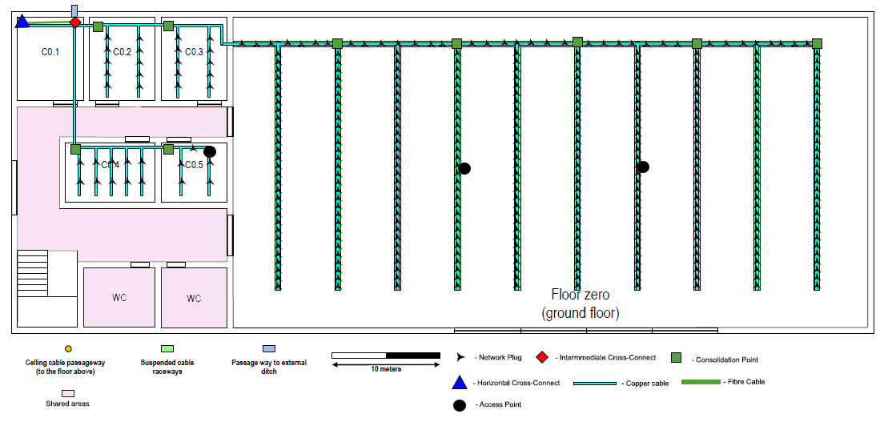
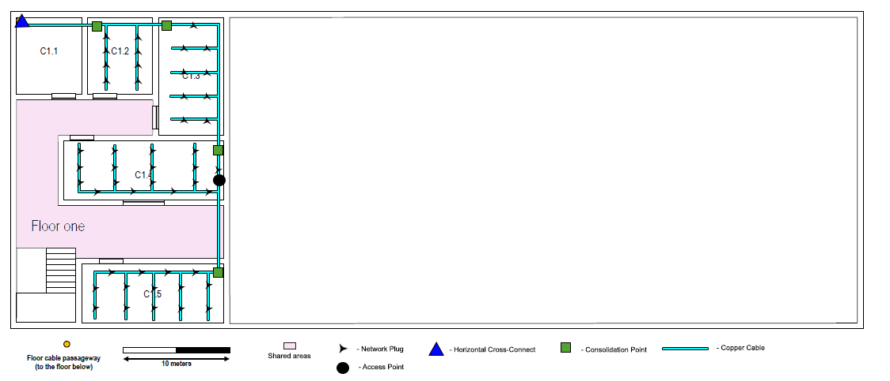

RCOMP 2019-2020 Project - Sprint 1 - Member 1180715 folder
===========================================
(This folder is to be created/edited by the team member 1180715 only)

Network cabling schematics for building C
--------------------------------------------------

The deployment schematics were designed using Adobe Photoshop. By setting the scale provided in the blueprint, using this software is very easy to measure the facilities in order to calculate the number of outlets and make an estimate of the ammount of cable, number of consolidation points and access points needed for the building.

### Active room dimensions

- C0.2, C0.3 : 6.10 X 7.7 m ( 47 m^2 ) = min. 10 outlets
- C0.4 : 8.3 x 5.5 m ( 46 m^2 ) = min. 10 outlets
- C0.5 : 6.1 x 5.5 m ( 34 m^2 ) = min. 7 outlets
- C1.2 : 5.9 x 7 m ( 41 m^2 ) = min. 8 outlets
- C1.3 : 6 x 11 m ( 66 m^2 ) = min. 13 outlets
- C1.4 : 14.8 x 5.6 ( 83 m^2) = min. 17 outlets
- C1.5 : 13 x 5.4 ( 70 m^2) = min. 14 outlets
- Open Area : 58.6 x 28.6 ( 1680 m^2 ) = min.  336 outlets

Rooms C0.1 and C1.1 dimensions are not present since they were reserved for the building backbone housing the horizontal cross-connects and intermediate cross-connect. This decision was made since these rooms had the pass way to the external technical ditch and the ceiling cable passageway.     
Each floor has been fitted with an horizontal cross-connect, housed in the rooms above mentioned.
Every room has been fitted with a Cross-Connect, and the open area has 5 Cross-Connects, to make sure that no cable will be bigger than 80m, and to guarantee that in case of failure, it will be easier to detect the fault.   
Access Points have been placed as close as possible to the center of the building, to make sure that the ammount of signal going out is mitigated, but still making sure that there is coverage in the needed spaces. For this purpose, 3 Access Points have been placed in the ground floor, and 1 access points was considered enough for the first floor. Having more than 1 Access Point on the ground floor was considered crucial since this is an area where there will be plenty of people working, and having a single access point for a lot of people is not a great idea.   
Cable-wise, since the majority of end-user devices does not support an optical fibre connection, CAT7 copper cables were used for this purpose. As for the outside connections to the backbone, Multimode Optical Fiber Cable has been chosen, due to it's quality and speed. Also, as the distance is less than 1000m, Monomode is not required.    
It has also been ensured multiple cables for the same paths, to guarantee a backup in case of failure.  

### Inventory
- 1    Intermmediate Cross-Connect
- 2    Horizontal Cross-Connect
- 13   Consolidation Points
- 415  Network Plugs
- 4    Access Points
- 830  CAT7 Copper Patch Cords
- 11   CAT7 24 port copper patch panel 
- 6    CAT7 48 port copper patch panel 
- 12000m  Copper Cable CAT7
- 130m Multimode Optical Fiber
- 6U x 1m Intermediate Cross-Connect Telecommunications enclosure
- 12U x 1m Horizontal Cross-Connect Telecommunications enclosure on ground floor
- 12U x 1m Horizontal Cross-Connect Telecommunications enclosure on first floor