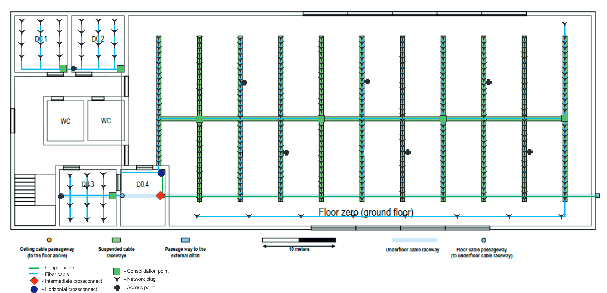
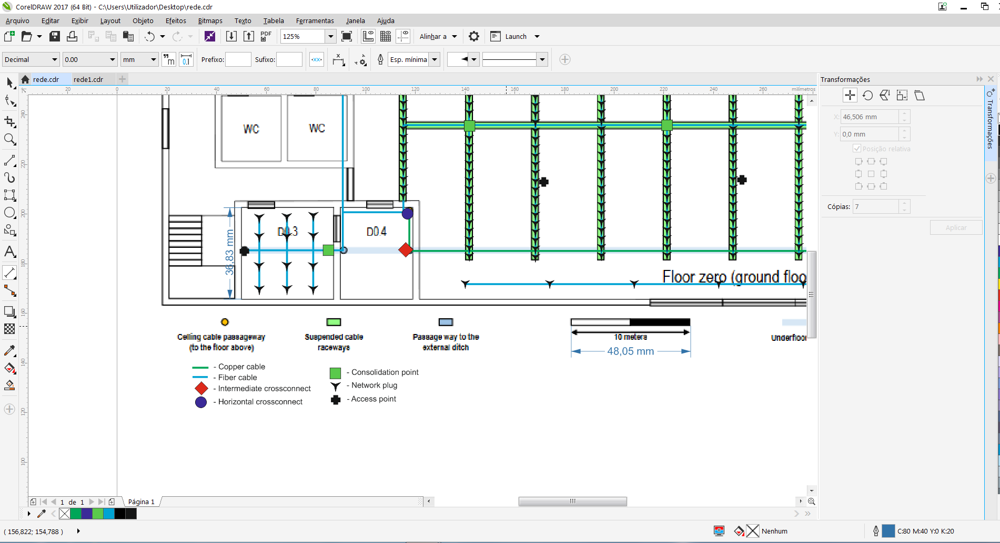

RCOMP 2019-2020 Project - Sprint 1 - Member 1180723 folder
===========================================
(This folder is to be created/edited by the team member 1180723 only)

Network cabling deployment schematics of Building D
-----------------------------------------

The network cabling deployment schematics of building D were made in CorelDRAW 2017. Among other features, this program has a built-in measuring tool capable of measuring distances very precisely. Using this feature, it was possible to measure every room's dimensions accurately.
This was achieved by importing each floor's schematics into CorelDRAW, measuring the length of the distance scale, measuring the room's dimensions and converting the result to meters. For example, D0.3 width was measured to be approximately 36.83 mm and the scale's length is 48.05 mm. Since the scale represents 10 m, D0.3's width is roughly 7.7 m (36.83 * 10000 / 48.05 ~= 7700 mm).

Inventory and cabling deployment breakdown
---------------
### Room dimensions:

- D0.1, D0.2, D1.1, D1.2 : ~ 7.3 x 7.7 m (56 m^2) = min. 12 outlets
- D0.3 : ~ 7.7 x 7.7 m (59 m^2) = min. 12 outlets
- D0.4 : ~ 7.7 x 5.9 m (45 m^2) = 0 outlets \*
- D1.3 : ~ 8.6 x 10.9 m (94 m^2) = min. 20 outlets
- D1.4 : ~ 5.0 x 5.9 m (30 m^2) = 0 outlets \*

The open area on the right side of the building is roughly 1724 m^2, thus making the minimum number of network outlets required 346. Common areas have no network outlets, (\*) as well as rooms D0.4 and D1.4, since these contain the Intermediate Crossconnect (Building Distributor) and each floor's respective Horizontal Crossconnect (Floor Distributors). In total, 426 network outlets have been placed.

Each room with network outlets has been fitted with its own Consolidation Point. The open area has 6 Consolidation Points. This was done in order to decrease the maximum length of cable. 
Wireless access points have been placed in order to provide full Wi-Fi coverage in the building: Floor 0 has 8 wireless access points (6 spread out over the open area, two in the left side of the building), Floor 1 has 1 access point.

Fiber cable enters the building through the passage way from the external ditch and passes under the open area, until reaching room D0.4, where it connects to the building's IC and Floor's 0 HC. Copper cables then enter the dropped ceiling and split in three directions, one being the left side of the building, another the suspended cable raceways of the open area and the other to floor above. On the left side, the cables split once more: a section heads into D0.3's CP, where it connects to the room's outlets and wireless access point. The other section goes over the bathroom and into the CP in D0.2, where it connects to the room's outlets and access point and D0.1's CP, and connects to that room's outlets.
The section of cables in the open area follow the suspended cable raceways, connecting to outlets, access points and CPs along the way. A section of cable goes through the south side of the open area, lengthwise, in order to give better outlet coverage in that area.

On Floor 1, copper cables go into D1.3's CP and its outlets. The cables then head into the access point in the common area, followed by D1.4's CP and its outlets, and ending by going to D1.3's CP and its outlets.

The required materials are as follows:

- 270 m of optical multimode fiber cable
- 18500 m of copper cable (CAT7)
- 426 network outlets
- 9 wireless access points
- 10 CAT7 48 port copper patch panels
- 3 CAT7 24 port fibre patch panels
- 1 intermediate cross-connect
- 2 horizontal cross-connects
- 10 consolidation points
- 40 optical fibre CAT7 patch cords
- 852 copper CAT7 patch cords
- 1 6U telecommunications enclosure (intermediate cross-connect)
- 2 8U telecommunications enclosure (horizontal cross-connect)