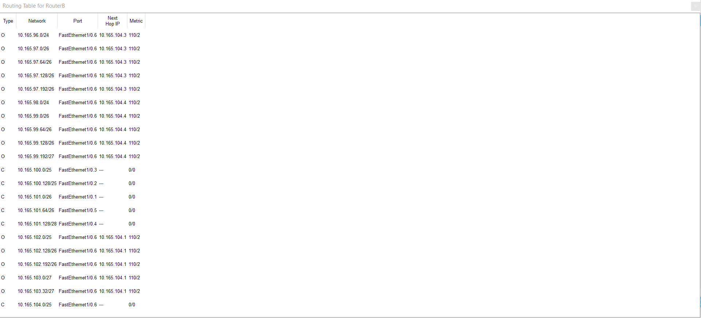
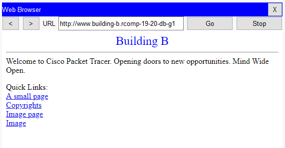
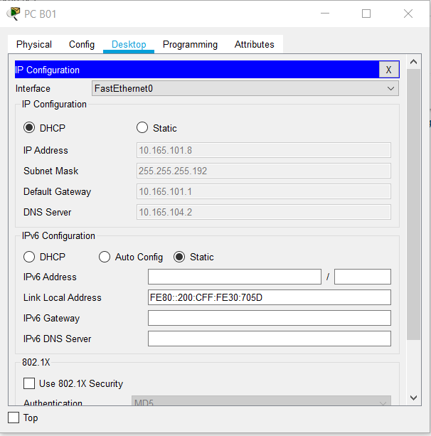
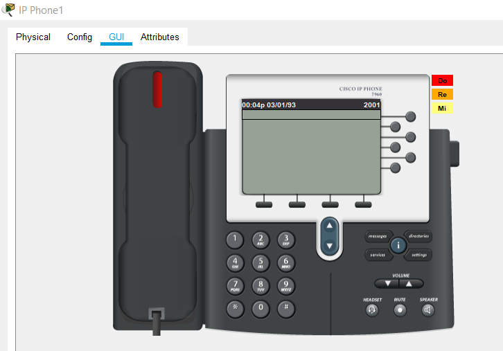

 Sprint 3 - 1180712
===========================================
## OSPF

In every router two areas were defined, the area 0 belonging to the backbone and the area that belongs to the building the router is in. In case of the building B the other area defined was area 2.

- Building B routing table

## HTTP

An HTTP/HTTPS server was created in each of the buildings having a page that show which building it belongs to. 

## DHCPv4

DHCPv4 was used for every network on each building except for the servers and the backbone. The excluded were the ones that were already in use for the router's sub-interfaces and the broadcast ones.

For VOIP option 150 was used, as requested. As DNS server the IPv4 of backbone(10.165.104.2) was used because of the way NAT was applied.

## VOIP

Configuration of the DHCPv4 for the VOIP vlan was needed before attributing numbers.

After that, for VOIP related to building B, the automatic way of attributing phone numbers was used. Number 2000 and 2001 was attributed to the phones here present. For redirecting call to other buildings, each router's building would be the one responsible for analysing the schema and deciding which building the call should go to.

## DNS

Building A will be the one responsible for knowing all the name servers. If a building doesn't know a name server it sends the information to the building A DNS that analysis and chooses the right DNS on other buildings. The remaining buildings know their own name servers and the building A name server.

Also building A will have the highest domain name, which is "rcomp-19-20-db-g1", while the rest of the buildings will be in the format "building-n.rcomp-19-20-db-g1" where n is the letter of the building.

- Building B DNS

- Building A DNS

## NAT

Nat was used to hide the HTTP/HTTPS and the DNS server, this means that the outside IPv4 would be the backbone one and the inside would be the one related to servers. The server sub-interface was used as the inside interface and the remaining sub-interfaces as the outside ones. Using only the backbone interface as the outside was not possible since when configuring the DNS the IPv4 used for a certain building would be the one belonging to the backbone which means that connecting to the name server wouldn't work that way. In case of building B the IPv4 belonging to the backbone is 10.165.104.2 and to the servers is 10.165.101.128/28.

## ACL

ACL 100 - responsible for avoiding internal spoofing and allowing DNS access by the ground floor vlan.

ACL 101 - responsible for avoiding internal spoofing and allowing DNS access by the first floor vlan.

ACL 102 - responsible for avoiding internal spoofing and allowing DNS access by the WIFI vlan.

ACL 103 - responsible for only allowing calls to leave the router through the TFTP, ITS service and the door 2000 and avoid internal spoofing. Applied at VOIP vlan.

ACL 104 - responsible for avoiding external spoofing and only allowing ICMP requests to the end nodes of the building and TFTP and ITS services , OSPF traffic and traffic related to NAT, which means tcp and udp  protocol directed to backbone IPv4. Everything else directed the the backbone is denied. Applied in the backbone sub-interface 10.165.104.2.

ACL 105 - responsible for avoiding internal spoofing and only allowing ICMP requests and tcp and udp protocols through the doors 80, 443 e 53 related to DNS and HTTP/HTTPS.

More detailed information regarding ACL can be found in the configuration files.