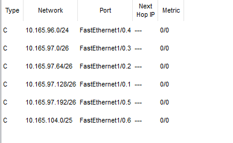
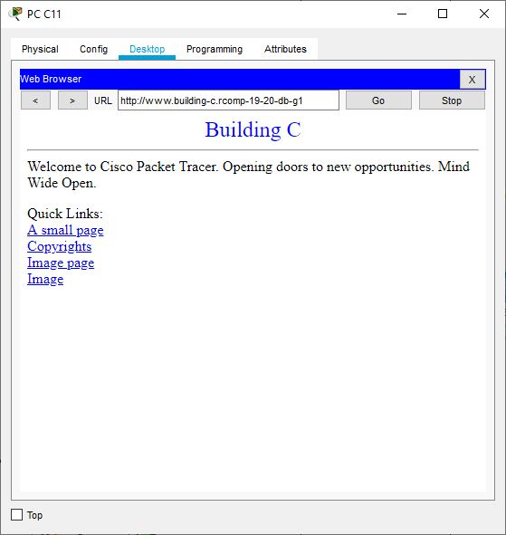
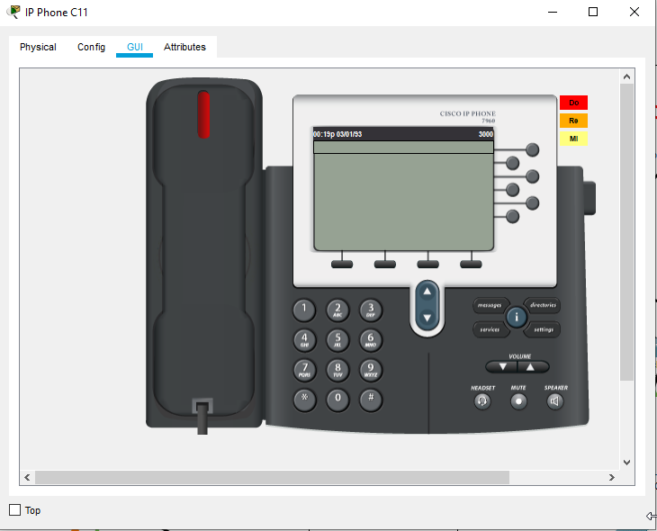
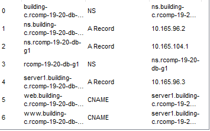
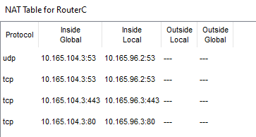

Sprint 3 - 1180715
===========================================
## OSPF

In every router two areas were defined, the area 0 belonging to the campus backbone and the area that belongs to the building the router is in. In case of the building C, that area was defined as area 3.

## HTTP

An HTTP/HTTPS server was created in each building, having a page that indicates which building it belongs to. 

## DHCPv4

DHCPv4 was used for every network on each building except for the servers and the backbone.

For VOIP option 150 was used, as requested. As for the DNS server, the IPv4 address of the router (10.165.104.3) was used because of the way NAT was applied.

## VOIP

Configuration of the DHCPv4 for the VoIP VLAN was needed before attributing numbers.

For VoIP related to building C, the phone number registering process was automatic. Numbers 3000 and 3001 were attributed to the phones present in the simulation. For redirecting calls to other buildings, each building's router would be the one responsible for deciding which building the call should go to.

## DNS

Building A will be the one responsible for knowing all the domain name servers. If a building doesn't know a name server, it sends the information to building A's DNS that analyses and chooses the right building to redirect. The remaining buildings know their own name servers and building A's name server.

Building A will also have the highest domain name, which is "rcomp-19-20-db-g1", while the rest of the buildings will be in the format "building-n.rcomp-19-20-db-g1", where n is the letter of the building.

- Building C DNS

- Building A DNS

## NAT

NAT was used to avoid spoofing and to "hide" the DNS server. Packages from the building's network will have their source address changed to the Router backbone address when received by other building's networks.

## ACL

ACL 100 - responsible for avoiding internal spoofing and allowing DNS access by the ground floor vlan.

ACL 101 - responsible for avoiding internal spoofing and allowing DNS access by the first floor vlan.

ACL 102 - responsible for avoiding internal spoofing and allowing DNS access by the WIFI vlan.

ACL 103 - responsible for only allowing calls to leave the router through the TFTP, ITS service and the door 2000 and avoid internal spoofing. Applied at VOIP vlan.

ACL 104 - responsible for avoiding external spoofing and only allowing ICMP requests to the end nodes of the building and TFTP and ITS services , OSPF traffic and traffic related to NAT, which means tcp and udp  protocol directed to backbone IPv4. Everything else directed the the backbone is denied. Applied in the backbone sub-interface 10.165.104.3.

ACL 105 - responsible for avoiding internal spoofing and only allowing ICMP requests and tcp and udp protocols through the doors 80, 443 e 53 related to DNS and HTTP/HTTPS.

More detailed information regarding ACL can be found in the configuration files.